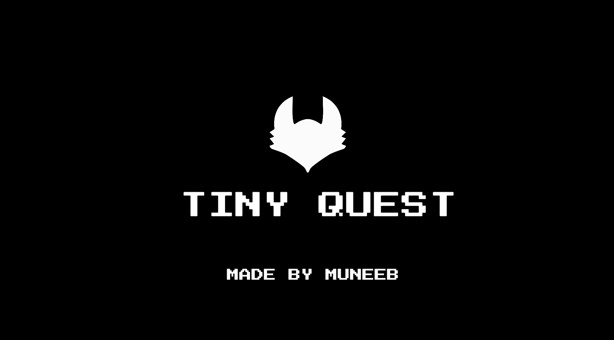
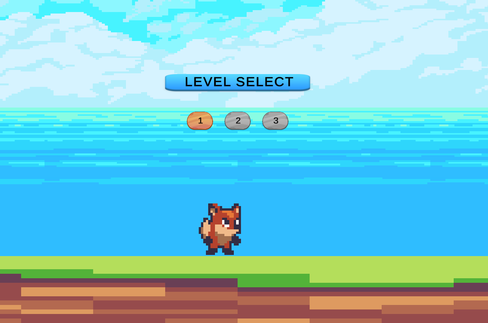
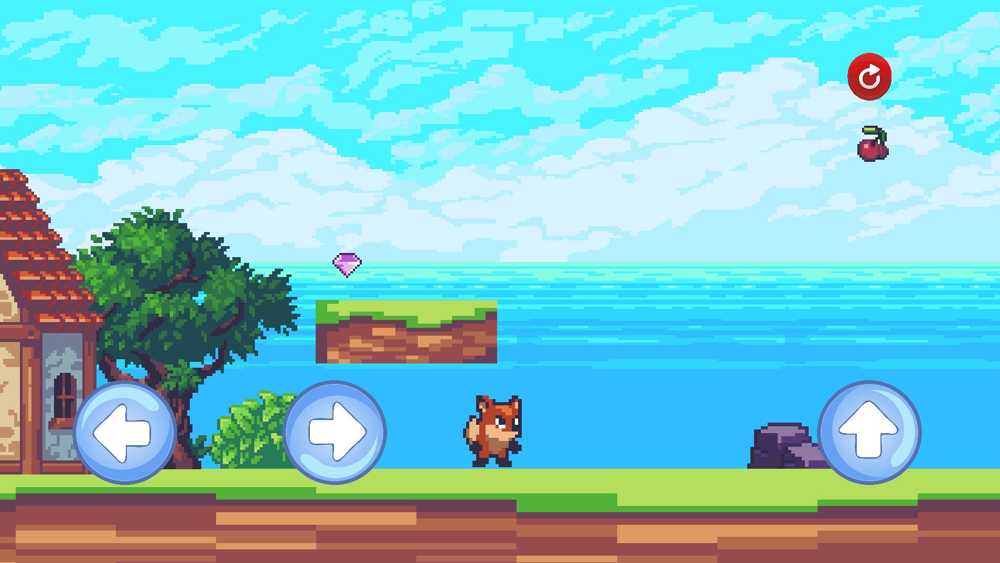
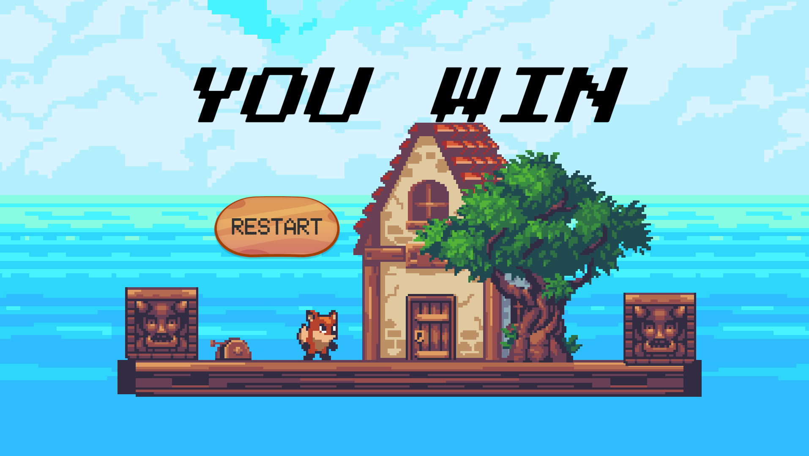

# 🎮 Tiny Quest – A 2D Platformer Game

## 🧠 Overview

**Tiny Quest** is a fun and challenging 2D platformer game built in **Unity** using **C#** and the **New Unity Input System**. The objective is simple yet engaging: avoid deadly obstacles, jump over gaps, and reach the checkpoints.

The game was developed as part of our Game Development coursework and focuses on:
- Core gameplay mechanics  
- UI interaction  
- Sound integration  
- Mobile deployment (Android APK)

---

## 🛠️ Development Tools

| Tool                     | Purpose                          |
|--------------------------|----------------------------------|
| Unity                    | Game engine                      |
| C#                       | Scripting language               |
| Unity Input System (new) | Player movement controls         |
| Rigidbody2D              | Physics & movement               |
| Animator                 | Character animation              |
| Canvas UI                | Mobile buttons (left, right, jump)|
| Audio Source             | Sound effects                    |

---

## 🎨 Assets Used

| Asset Name    | Source               | Purpose                             |
|---------------|----------------------|-------------------------------------|
| Sunny Land    | Unity Asset Store    | Game environment, player, enemies   |
| PNG Tree      | [pngtree.com](https://pngtree.com)         | UI icons for buttons                |
| Sound Effects | [mixkit.co](https://mixkit.co)             | Jump, death, respawn sounds         |
| Music         | [freesound.org](https://freesound.org)     | Background music                    |

---

## 🎮 Gameplay Features

- ✅ **Jump, Move Left & Right Controls**  
  Supports both mobile (touch buttons) and PC (keyboard).
  
- 💀 **Death Zones & Respawn Points**  
  Player respawns at last checkpoint after falling or hitting an enemy.

- 📍 **Checkpoints**  
  Save your progress mid-level.

- 🕹️ **Animations**  
  Idle, run, and falling states using Unity's Animator.

- 🔊 **Audio**  
  Background music + jump/death effects with `AudioSource`.

---

## 📱 Mobile Support

- Built using **Unity's Android Build Support**.
- Controls mapped to **on-screen UI buttons**: left, right, and jump.
- APK tested on Android — ✅ touch controls working as expected.

---

## 🔍 Challenges Faced

- 🐢 **Lag from Tilemaps**  
  Fixed by reducing draw calls and compressing sprites.

- 🤯 **New Input System**  
  Took time to fully understand and implement properly.

- 📱 **UI Positioning on Mobile**  
  Ensured responsiveness across multiple screen sizes.

---

## 🖼️ Screenshots & Gameplay

